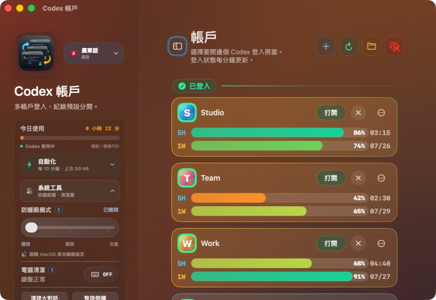
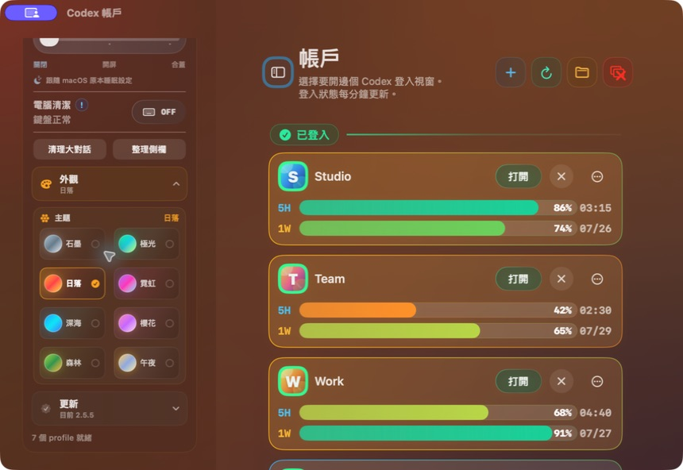

# Codex Accounts

**Languages:** [繁體中文](#繁體中文) | [简体中文](#简体中文) | [English](#english)





> 私隱說明 / Privacy: 圖中所有 profile 名稱、`/tmp/demo-profiles` 路徑及 quota 數值均為虛構示範資料。All profile names, `/tmp/demo-profiles` paths, and quota values shown above are fictional demo data.

---

<a id="繁體中文"></a>

## 繁體中文

Codex Accounts 是一個 macOS 小工具，用來管理多個 Codex / OpenAI 帳戶。它會為每個 profile 開一個獨立的 Codex desktop 視窗，並分開 `CODEX_HOME` 和 Electron `user-data-dir`，所以不同 profile 可以保持不同登入狀態，不需要反覆登出登入。

### V2.6.0 更新介紹

V2.6.0 重新整理 quota 同登入狀態顯示：憑證確定失效時會清楚顯示「登入過期」或「需要登入」，已登入但暫時攞唔到官方用量時則顯示「暫時未能取得」，Reload 期間唔再閃出假嘅 `0%` 或 `00/00`。只有官方 OAuth 明確回覆 token 無效先會判定登入過期；一般網絡錯誤或 5xx 會保留上一個可用 quota。後備 quota 查詢亦會停用 MCP 同 plugins，減少背景程序同系統負荷。登入過期仍然需要使用者重新登入，App 唔會代替使用者修復或複製登入憑證。

### V2.5.5 更新介紹

V2.5.5 修正「今日使用」喺睡眠、斷電或異常關機後可能超過 24 小時嘅問題，睡眠同關機時間唔會計算；登入狀態改以即時檢查為準，避免舊 cache 或暫時 403 將已登入帳戶誤標為未登入。防睡眠改為三段彩色滑桿：關閉、開屏防睡眠、合蓋繼續運行；合蓋模式需要 macOS 管理員確認，App 唔會保存密碼。主題整理成石墨、極光、日落、霓虹、深海、櫻花、森林、午夜 8 款，並修正名稱省略及卡片重疊。

### V2.5.3 更新介紹

V2.5.3 配合新版 ChatGPT Codex 同 GPT-5.6：移除會將對話模型強制改返 GPT-5.5 嘅資料庫 trigger，保留每個 profile 同每條對話自己揀嘅模型。對話同步改為避開使用中嘅 SQLite，開啟 profile 前先安全補齊索引；同時停止每 5 秒自動清理側欄，避免新對話或 project 被誤刪。自動化介面亦會顯示真實 10 分鐘同步週期、上次成功時間同手動整理入口，外觀主題亦重新調整冷暖配色，令介面層次更清楚。

### V2.5.2 更新介紹

V2.5.2 修正語言切換卡片過闊，撞到左側欄邊緣同 scroll indicator 嘅問題。今版亦加強書面繁體同簡體本地化轉換，避免「邊個」、「搵唔到」、「剔選」、「入面」、「掣」等廣東話詞語殘留喺非廣東話介面。

### V2.5.1 更新介紹

V2.5.1 將語言切換拆成香港廣東話、書面繁體中文、簡體中文、英文和日本語，修正廣東話介面被簡體字或書面中文規則污染嘅問題。今版亦優化對話包匯出選擇器，可以勾選多條指定對話先匯出；同時改善 quota cache、登入失效 marker 同 stale local thread catalog 清理，減少用量顯示異常同側邊欄出現無法恢復對話嘅情況。

### V2.5.0 更新介紹

V2.5.0 新增對話包匯出/導入功能，可以將單一 Codex 對話連同 rollout 記憶、thread state 同必要 metadata 打包成 `.codexshare`，再導入到單一或全部 profile；匯入前會備份本機 SQLite/index/global state，並把導入對話標記成最新。今版亦新增 8 個主題、改用 4 欄主題選擇器，並移除手機遠端 Bridge 功能同相關 bundle resource，避免 app 內再暴露不需要嘅遠端控制入口。

### V2.4.3 更新介紹

V2.4.3 修復跨 profile 共享對話紀錄時，project 對話一撳就消失或載入過慢嘅問題。同步流程依家會補齊每個 profile 嘅 `state_5.sqlite` thread metadata，並會由 `backups/history-link-*` 復原漏咗嘅 rollout / shell snapshot 檔；同時清理空白 project sidebar cache，令不同帳戶打開時都見到同一套最新對話紀錄。

### V2.4.2 更新介紹

V2.4.2 優化切換帳號時嘅 pre-launch 同步。打開 profile 前會先由所有 profile 收集最新記憶、project sidebar、thread index 同 goal mode state，但只寫返 primary 同即將打開嗰個 profile；手動「立即同步」仍然會做完整 fan-out。呢個版本大幅減少切換帳號後等待對話載入嘅時間，同時保留 project 對話同目標模式同步。

### V2.4.1 更新介紹

V2.4.1 修復 Codex 目標模式跨 profile 失效嘅問題。同步流程依家會合併各 profile 嘅 `goals_1.sqlite` / `thread_goals`，所以暫停中或進行中嘅目標喺換帳號後都可以繼續，避免因為目標 row 只存在其中一個 profile 而出現「無法更新目標」或「建立任務 timeout」。

### V2.4.0 更新介紹

V2.4.0 修復 project sidebar 同步缺口：除咗對話 DB，依家亦會同步 Codex frontend 用嘅 project/workspace roots，所以 `4229M Easystudio` 呢類「項目下面嘅對話」會喺其他 profile 側邊欄出返。今版亦優化 profile 卡片 hover / Dock-style 放大動畫，移除每一 pixel 滑鼠移動都觸發全列表重畫嘅路徑，並快取 profile icon 圖片，令上下滾動同 hover 動畫更順。

### V2.3.7 更新介紹

V2.3.7 修復新 profile 登入完成後無法保存本機 credentials 嘅問題。共享對話紀錄依家只會連結真正嘅對話資料，唔再把 `state_5.sqlite` 共享到其他 profile；打開 profile 前亦會自動移除舊版留下嘅 shared state symlink，避免 Codex 登入 server 寫入本機登入狀態時撞到 primary profile 嘅 state。

### V2.3.6 更新介紹

V2.3.6 修復自動刷新唔會準確更新 quota 嘅問題。自動刷新而家會定時做低負荷 live quota refresh，效果等同背景撳 Reload，但唔會播 loading pill 或 quota 數字倒數動畫；背景查詢改用單一並行度串行跑，避免短時間開太多 Codex app-server 或令 Mac 負荷升高。

### V2.3.5 更新介紹

V2.3.5 令右上角「關閉全部 Codex 視窗」反應快好多。底層 script 由逐個 profile 重複掃 `ps/pgrep`，改成一次 process snapshot 就計晒所有要關同要保留嘅 Codex 視窗；仍然會跳過 primary/default Codex，同埋保留有 active agent/app-server 工作嘅視窗，避免關到正在工作的對話。

### V2.3.4 更新介紹

V2.3.4 修復多 profile 用耐之後出現紅色 timeout、模型設定更新失敗、記憶同步似乎消失嘅問題。打開 profile 前仍然會同步記憶，但同步策略改為「全部 profile 記憶 + 目標 profile payload」：`AGENTS.md`、`memories/`、`rules/` 和外掛啟用設定會掃晒全部 profile，`plugins/`、`skills/`、`vendor_imports/` 只補 primary 同即將打開嘅 profile，並跳過 `plugin-backup-*` / `plugin-install-*` 垃圾目錄。自動刷新亦改為快取優先，手動 reload 先查 live quota，避免背景開大量 app-server。

### V2.3.3 更新介紹

V2.3.3 修復兩個阻塞問題：更新通道依家會寫入安裝 log、先備份舊 app 再替換，失敗會自動還原，亦會更新目前實際執行緊嘅 `Codex Accounts.app`。右上角「關閉全部 Codex 視窗」會跳過 primary/default Codex，只關 Codex Accounts 管理嘅 profile，同時避開 `--listen stdio://` / proxy 呢類背景 agent server，減少誤關工作中對話。

### V2.3.2 更新介紹

V2.3.2 修復更新後偶發「打開帳戶」冇反應嘅問題。原因係同步流程開始搬大量 `plugins/`、`skills/`、`vendor_imports/` payload，每個 profile 可能有幾百 MB，令開帳戶前嘅同步被 `rsync` 卡住。依家 `sync-once` 預設只同步記憶、rules、AGENTS 同外掛啟用設定；重型外掛 payload 要手動用 `CODEX_SYNC_PLUGIN_PAYLOADS=1` 才會同步。打開 profile 時亦唔再被同步/共享紀錄失敗阻塞，會盡快繼續開啟目標帳戶。App 重新開啟或 Dock 點擊時亦會重新顯示主視窗。

### V2.3.1 更新介紹

V2.3.1 修復三個即時使用問題：當 direct ChatGPT 用量接口暫時被 401/403 或 Cloudflare 擋住時，app 會改用 Codex 官方 app-server rate-limit API 讀取真實 quota；如果仍然攞唔到官方數據，就停止用過期 cache 扮最新數。最細視窗寬度下，頂部跳轉掣同右上角 `+ / reload / folder / close all` 工具列亦收窄排版，避免 `+` 掣同其他掣重疊。多帳戶同步現在亦會同步 `plugins/`、`skills/`、`vendor_imports/`，並合併各帳戶 `config.toml` 入面啟用咗嘅外掛。

### V2.3.0 更新介紹

V2.3.0 重點修復長時間使用後偶發卡死嘅問題。外部 Codex script / 系統 helper 依家唔再用會累積卡住線程嘅等待方式，所有背景 Codex 工作會串行處理；自動刷新同自動同步亦會輪流執行，避免同一時間爭用 profile 檔案。防睡眠狀態檢查加咗 in-flight guard 同節流，減少用耐之後背景 process 疊住跑。

### v2 主要功能

- 多 profile 管理：新增、打開、關閉、改名、顯示資料夾、封存和刪除 profile。
- 每個 profile 獨立登入：不同 OpenAI / GPT 帳戶互不混用 session。
- 打開 profile 前先同步：先同步本機記憶、rules、AGENTS 同外掛設定，之後才打開該帳戶視窗。
- 用量顯示：顯示 5H / 1W 額度、百分比和恢復時間；「今日使用」只計 Codex 實際運行時間，睡眠同關機時間唔會計算。
- 狀態自動整理：每分鐘刷新登入狀態和 quota，保留最近可用數據，避免畫面突然全變未知。
- 本機對話紀錄共享：可選擇將本機 Codex history 共享到其他 profile。
- 記憶與外掛同步：可同步 `AGENTS.md`、`memories/`、`rules/`、`plugins/`、`skills/`、`vendor_imports/`，外掛啟用狀態會喺不同帳號之間合併。
- 三段防睡眠：關閉、開屏防睡眠、合蓋繼續運行；開屏模式使用 `caffeinate`，合蓋模式需要 macOS 管理員確認，離開時會恢復系統設定。
- 電腦清潔模式：暫停大部分鍵盤輸入，方便清潔鍵盤，保留滑鼠/觸控板操作去關閉模式。
- 對話包匯出/導入：可把單一對話打包成 `.codexshare`，匯入到單一或全部 profile，方便可信團隊交接上下文。
- 更新通道：檢查 GitHub release，驗證下載檔版本同 bundle id，然後自動替換 `/Applications/Codex Accounts.app`。
- Liquid Glass 介面：8 款高辨識主題、hover 發光、profile 卡片動效、廣東話 / 繁體中文 / 簡體中文 / 英文 / 日本語介面。
- 菜單列控制：快速新增、同步、關閉所有 Codex 視窗、切換防睡眠。

### 不會做的事

- 不會複製 OpenAI auth token、cookie 或 account session 到其他 profile。
- 不會同步 OpenAI 雲端對話，也不會同步 ChatGPT server-side memory。
- 不會把帳戶憑證傳到第三方。
- 用量查詢只會使用該 profile 的本機 token 請求官方 Codex / ChatGPT 用量接口。
- 這是非官方輔助工具，與 OpenAI 沒有從屬關係。

### 安裝

系統需求：macOS 14 或以上。

1. 到 [Releases](https://github.com/siumiu1968/codex-accounts/releases) 下載 `Codex-Accounts-macOS.zip`。
2. 解壓後把 `Codex Accounts.app` 移到 `/Applications`。
3. 從 Finder 開啟 app。

如果 macOS 阻擋第一次開啟，進入 `System Settings` → `Privacy & Security`，找到 `Codex Accounts`，選擇 `Open Anyway`。

安裝 V2.6.0 之後，可以直接喺 app 入面檢查同安裝下一個 GitHub release。

### 從源碼構建

```zsh
git clone https://github.com/siumiu1968/codex-accounts.git
cd codex-accounts
scripts/build_codex_accounts_app.zsh
open "/Applications/Codex Accounts.app"
```

建立 release ZIP：

```zsh
scripts/package_release.zsh
```

輸出位置：

```text
dist/Codex-Accounts-macOS.zip
```


### 本機資料位置

```text
Account 1: ~/.codex
Account 2: ~/.codex-account2
More profiles: ~/.codex-accounts/<profile-name>
```

Electron app data 會分開放在：

```text
Account 1: ~/Library/Application Support/Codex
Account 2: ~/Library/Application Support/Codex Account 2
More profiles: ~/Library/Application Support/Codex Accounts/<profile-name>
```

刪除 profile 時會先封存到：

```text
~/.codex-accounts-archive
```

---

<a id="简体中文"></a>

## 简体中文

Codex Accounts 是一个 macOS 小工具，用来管理多个 Codex / OpenAI 账号。它会为每个 profile 打开一个独立的 Codex desktop 窗口，并分开 `CODEX_HOME` 和 Electron `user-data-dir`，所以不同 profile 可以保持不同登录状态，不需要反复登出登录。

### V2.6.0 更新介绍

V2.6.0 重新整理 quota 和登录状态显示：凭证确定失效时会清楚显示“登录过期”或“需要登录”，已登录但暂时无法取得官方用量时则显示“暂时无法取得”，Reload 期间不再闪出虚假的 `0%` 或 `00/00`。只有官方 OAuth 明确返回 token 无效时才会判定登录过期；一般网络错误或 5xx 会保留上一份可用 quota。备用 quota 查询也会停用 MCP 和 plugins，减少后台进程与系统负载。登录过期仍然需要用户重新登录，应用不会代替用户修复或复制登录凭证。

### V2.5.5 更新介绍

V2.5.5 修正“今日使用”在睡眠、断电或异常关机后可能超过 24 小时的问题，睡眠和关机时间不会计入；登录状态改为以实时检查为准，避免旧 cache 或临时 403 将已登录账号误标为未登录。防睡眠改为三段彩色滑杆：关闭、开屏防睡眠、合盖继续运行；合盖模式需要 macOS 管理员确认，App 不会保存密码。主题整理为石墨、极光、日落、霓虹、深海、樱花、森林、午夜 8 款，并修正名称省略和卡片重叠。

### V2.5.3 更新介绍

V2.5.3 适配新版 ChatGPT Codex 和 GPT-5.6：移除会把对话模型强制改回 GPT-5.5 的数据库 trigger，保留每个 profile 和每条对话自行选择的模型。对话同步现在会避开正在使用的 SQLite，并在打开 profile 前安全补齐索引；同时停止每 5 秒自动清理侧栏，避免误删新对话或 project。自动化界面也会显示真实的 10 分钟同步周期、上次成功时间和手动整理入口，外观主题也重新调整冷暖配色，让界面层次更清晰。

### V2.5.2 更新介绍

V2.5.2 修正语言切换卡片过宽，撞到左侧栏边缘和 scroll indicator 的问题。本版也加强书面繁体和简体本地化转换，避免“边个”、“找不到”、“勾选”、“里面”、“按钮”等粤语或转换不完整词语残留在非粤语界面。

### V2.5.1 更新介绍

V2.5.1 将语言切换拆成香港粤语、书面繁体中文、简体中文、英文和日文，修正粤语界面被简体字或书面中文规则污染的问题。本版也优化对话包导出选择器，可以勾选多条指定对话后再导出；同时改善 quota cache、登录失效 marker 和 stale local thread catalog 清理，减少用量显示异常和侧边栏出现无法恢复对话的情况。

### V2.5.0 更新介绍

V2.5.0 新增对话包导出/导入功能，可以将单一 Codex 对话连同 rollout 记忆、thread state 和必要 metadata 打包成 `.codexshare`，再导入到单一或全部 profile；导入前会备份本地 SQLite/index/global state，并把导入对话标记成最新。本版也新增 8 个主题、改用 4 栏主题选择器，并移除手机远程 Bridge 功能和相关 bundle resource，避免 app 内继续暴露不需要的远程控制入口。

### V2.4.3 更新介绍

V2.4.3 修复跨 profile 共享对话记录时，project 对话一点就消失或加载过慢的问题。同步流程现在会补齐每个 profile 的 `state_5.sqlite` thread metadata，并会从 `backups/history-link-*` 复原遗漏的 rollout / shell snapshot 文件；同时清理空白 project sidebar cache，让不同账号打开时都看到同一套最新对话记录。

### V2.4.2 更新介绍

V2.4.2 优化切换账号时的 pre-launch 同步。打开 profile 前会先从所有 profile 收集最新记忆、project sidebar、thread index 和 goal mode state，但只写回 primary 和即将打开的 profile；手动“立即同步”仍然会做完整 fan-out。这个版本大幅减少切换账号后等待对话加载的时间，同时保留 project 对话和目标模式同步。

### V2.4.1 更新介绍

V2.4.1 修复 Codex 目标模式跨 profile 失效的问题。同步流程现在会合并各 profile 的 `goals_1.sqlite` / `thread_goals`，所以暂停中或进行中的目标在切换账号后也可以继续，避免因为目标 row 只存在其中一个 profile 而出现“无法更新目标”或“创建任务 timeout”。

### V2.4.0 更新介绍

V2.4.0 修复 project sidebar 同步缺口：除了对话 DB，现在也会同步 Codex frontend 使用的 project/workspace roots，所以 `4229M Easystudio` 这类“项目下面的对话”会在其他 profile 侧边栏重新出现。本版也优化 profile 卡片 hover / Dock-style 放大动画，移除每一 pixel 鼠标移动都触发全列表重绘的路径，并缓存 profile icon 图片，让上下滚动和 hover 动画更顺。

### V2.3.7 更新介绍

V2.3.7 修复新 profile 登录完成后无法保存本机 credentials 的问题。共享对话记录现在只会链接真正的对话资料，不再把 `state_5.sqlite` 共享到其他 profile；打开 profile 前也会自动移除旧版留下的 shared state symlink，避免 Codex 登录 server 写入本机登录状态时撞到 primary profile 的 state。

### V2.3.6 更新介绍

V2.3.6 修复自动刷新不会准确更新 quota 的问题。自动刷新现在会定时做低负荷 live quota refresh，效果等同后台点击 Reload，但不会播放 loading pill 或 quota 数字倒数动画；后台查询改用单一并行度串行运行，避免短时间打开太多 Codex app-server 或让 Mac 负荷升高。

### V2.3.5 更新介绍

V2.3.5 让右上角“关闭全部 Codex 窗口”反应快很多。底层 script 从逐个 profile 重复扫描 `ps/pgrep`，改成一次 process snapshot 就算出所有要关闭和要保留的 Codex 窗口；仍然会跳过 primary/default Codex，并保留有 active agent/app-server 工作的窗口，避免关掉正在工作的对话。

### V2.3.4 更新介绍

V2.3.4 修复多 profile 用久之后出现红色 timeout、模型设置更新失败、记忆同步看似消失的问题。打开 profile 前仍然会同步记忆，但同步策略改为“全部 profile 记忆 + 目标 profile payload”：`AGENTS.md`、`memories/`、`rules/` 和插件启用设置会扫描所有 profile，`plugins/`、`skills/`、`vendor_imports/` 只补 primary 和即将打开的 profile，并跳过 `plugin-backup-*` / `plugin-install-*` 垃圾目录。自动刷新也改为快取优先，手动 reload 才查 live quota，避免后台打开大量 app-server。

### V2.3.3 更新介绍

V2.3.3 修复两个阻塞问题：更新通道现在会写入安装 log、先备份旧 app 再替换，失败会自动还原，也会更新当前实际运行的 `Codex Accounts.app`。右上角“关闭全部 Codex 窗口”会跳过 primary/default Codex，只关闭 Codex Accounts 管理的 profile，同时避开 `--listen stdio://` / proxy 这类后台 agent server，减少误关工作中的对话。

### V2.3.2 更新介绍

V2.3.2 修复更新后偶发“打开账号”没有反应的问题。原因是同步流程开始搬运大量 `plugins/`、`skills/`、`vendor_imports/` payload，每个 profile 可能有几百 MB，导致打开账号前的同步被 `rsync` 卡住。现在 `sync-once` 默认只同步记忆、rules、AGENTS 和插件启用设置；重型插件 payload 需要手动用 `CODEX_SYNC_PLUGIN_PAYLOADS=1` 才会同步。打开 profile 时也不再被同步/共享记录失败阻塞，会尽快继续打开目标账号。App 重新打开或点击 Dock 时也会重新显示主窗口。

### V2.3.1 更新介绍

V2.3.1 修复三个即时使用问题：当 direct ChatGPT 用量接口临时被 401/403 或 Cloudflare 拦截时，app 会改用 Codex 官方 app-server rate-limit API 读取真实 quota；如果仍然拿不到官方数据，就停止用过期 cache 冒充最新数值。最小窗口宽度下，顶部跳转按钮和右上角 `+ / reload / folder / close all` 工具列也收窄排版，避免 `+` 按钮和其他按钮重叠。多账号同步现在也会同步 `plugins/`、`skills/`、`vendor_imports/`，并合并各账号 `config.toml` 里已启用的插件。

### V2.3.0 更新介绍

V2.3.0 重点修复长时间使用后偶发卡死的问题。外部 Codex script / 系统 helper 现在不再使用会累积卡住线程的等待方式，所有后台 Codex 工作会串行处理；自动刷新和自动同步也会轮流执行，避免同一时间争用 profile 文件。防睡眠状态检查加入 in-flight guard 和节流，减少用久之后后台 process 叠加运行。

### v2 主要功能

- 多 profile 管理：新增、打开、关闭、改名、显示资料夹、归档和删除 profile。
- 每个 profile 独立登录：不同 OpenAI / GPT 账号互不混用 session。
- 打开 profile 前先同步：先同步本地记忆、rules、AGENTS 和插件设置，然后才打开该账号窗口。
- 用量显示：显示 5H / 1W 额度、百分比和恢复时间；“今日使用”只计算 Codex 实际运行时间，睡眠和关机时间不会计入。
- 状态自动整理：每分钟刷新登录状态和 quota，保留最近可用数据，避免画面突然全变未知。
- 本地对话记录共享：可选择将本地 Codex history 共享到其他 profile。
- 记忆与插件同步：可同步 `AGENTS.md`、`memories/`、`rules/`、`plugins/`、`skills/`、`vendor_imports/`，插件启用状态会在不同账号之间合并。
- 三段防睡眠：关闭、开屏防睡眠、合盖继续运行；开屏模式使用 `caffeinate`，合盖模式需要 macOS 管理员确认，离开时会恢复系统设置。
- 电脑清洁模式：暂停大部分键盘输入，方便清洁键盘，保留鼠标/触控板操作去关闭模式。
- 对话包导出/导入：可把单一对话打包成 `.codexshare`，导入到单一或全部 profile，方便可信团队交接上下文。
- 更新通道：检查 GitHub release，验证下载文件版本和 bundle id，然后自动替换 `/Applications/Codex Accounts.app`。
- Liquid Glass 界面：8 款高辨识度主题、hover 发光、profile 卡片动效、香港粤语 / 繁体中文 / 简体中文 / 英文 / 日文界面。
- 菜单栏控制：快速新增、同步、关闭所有 Codex 窗口、切换防睡眠。

### 它不会做什么

- 不会复制 OpenAI auth token、cookie 或 account session 到其他 profile。
- 不会同步 OpenAI 云端对话，也不会同步 ChatGPT server-side memory。
- 不会把账号凭证发送到第三方。
- 用量查询只会使用该 profile 的本地 token 请求官方 Codex / ChatGPT 用量接口。
- 这是非官方辅助工具，与 OpenAI 没有关联。

### 安装

系统要求：macOS 14 或更高版本。

1. 到 [Releases](https://github.com/siumiu1968/codex-accounts/releases) 下载 `Codex-Accounts-macOS.zip`。
2. 解压后把 `Codex Accounts.app` 移到 `/Applications`。
3. 从 Finder 打开 app。

如果 macOS 阻挡第一次打开，进入 `System Settings` → `Privacy & Security`，找到 `Codex Accounts`，选择 `Open Anyway`。

安装 V2.6.0 之后，可以直接在 app 里检查并安装下一个 GitHub release。

### 从源码构建

```zsh
git clone https://github.com/siumiu1968/codex-accounts.git
cd codex-accounts
scripts/build_codex_accounts_app.zsh
open "/Applications/Codex Accounts.app"
```

创建 release ZIP：

```zsh
scripts/package_release.zsh
```

输出位置：

```text
dist/Codex-Accounts-macOS.zip
```


### 本地数据位置

```text
Account 1: ~/.codex
Account 2: ~/.codex-account2
More profiles: ~/.codex-accounts/<profile-name>
```

Electron app data 会分开保存在：

```text
Account 1: ~/Library/Application Support/Codex
Account 2: ~/Library/Application Support/Codex Account 2
More profiles: ~/Library/Application Support/Codex Accounts/<profile-name>
```

删除 profile 时会先归档到：

```text
~/.codex-accounts-archive
```

---

<a id="english"></a>

## English

Codex Accounts is a macOS helper app for managing multiple Codex / OpenAI accounts. It opens each profile in a separate Codex desktop window with its own `CODEX_HOME` and Electron `user-data-dir`, so different profiles can stay signed in to different accounts without constant logouts.

### V2.6.0 Update

V2.6.0 makes quota and sign-in states explicit. A profile with confirmed invalid credentials now shows **Sign-in expired** or **Sign-in required**, while a signed-in profile whose official usage data is temporarily unavailable shows **Usage temporarily unavailable**. Reload no longer flashes fabricated `0%` or `00/00` values. Only a definitive invalid-token response from the official OAuth service marks a sign-in as expired; network failures and 5xx responses keep the last usable quota. The fallback usage query also starts Codex app-server with MCP servers and plugins disabled, reducing background process and system load. Expired credentials still require the user to sign in again—the app does not repair or copy credentials automatically.

### V2.5.5 Update

V2.5.5 fixes Today usage exceeding 24 hours after sleep, power loss, or an unexpected shutdown; sleep and offline time are no longer counted. Live checks now take priority over stale cache or temporary 403 responses so signed-in profiles are not incorrectly marked as signed out. Keep Awake is now a color-coded three-level slider for Off, Screen Awake, and Lid Closed; Lid Closed mode requires macOS administrator approval, and the app never stores the password. The theme set is streamlined to eight distinct choices—Graphite, Aurora, Sunset, Neon, Ocean, Sakura, Forest, and Midnight—with fixes for truncated labels and overlapping cards.

### V2.5.3 Update

V2.5.3 adds compatibility for the unified ChatGPT Codex app and GPT-5.6. It removes database triggers that forced conversation models back to GPT-5.5, preserves each profile and thread model choice, skips SQLite databases that are currently in use, and reconciles indexes before opening a profile. The five-second sidebar cleanup loop is removed to avoid deleting new tasks or projects. Automation UI now shows the real ten-minute cadence, last successful sync, and a manual sidebar cleanup action. Appearance themes also receive clearer, balanced cool-and-warm palettes.

### V2.5.2 Update

V2.5.2 narrows the language switcher so it no longer collides with the left sidebar edge or scroll indicator. It also improves written Traditional Chinese and Simplified Chinese localization so Cantonese phrases such as "which one", "not found", "tick", "inside", and "button" do not leak into non-Cantonese UI modes.

### V2.5.1 Update

V2.5.1 separates the language switcher into Cantonese Hong Kong, written Traditional Chinese, Simplified Chinese, English, and Japanese, fixing cases where the Cantonese UI could be polluted by Simplified Chinese or formal written-Chinese conversions. It also improves conversation package export so users can tick multiple specific conversations before exporting, and hardens quota cache, auth-invalid markers, and stale local thread catalog cleanup to reduce broken usage cards and unrecoverable sidebar conversations.

### V2.5.0 Update

V2.5.0 adds conversation package export/import. A single Codex thread can be packaged as `.codexshare` with its rollout context, thread state, and required metadata, then imported into one profile or all profiles. Imports back up local SQLite/index/global state first and mark the imported thread as the latest conversation. This release also adds 8 new themes, switches the theme picker to a 4-column grid, and removes the Mobile Remote Bridge feature plus its bundled resources so the app no longer exposes an unused remote-control entry point.

### V2.4.3 Update

V2.4.3 fixes disappearing or slow-loading project conversations when multiple profiles share one local history set. The sync flow now backfills each profile's `state_5.sqlite` thread metadata, restores missing rollout / shell snapshot files from `backups/history-link-*`, and prunes empty project sidebar cache so every account opens the same latest conversation history.

### V2.4.2 Update

V2.4.2 optimizes the pre-launch sync used when switching accounts. Before opening a profile, Codex Accounts still reads the latest memory, project sidebar, thread index, and goal mode state from every profile, but writes only the primary profile and the profile being opened. Manual "Sync now" still performs the full fan-out sync. This significantly reduces the wait before switched profiles finish loading conversations while preserving project-thread and goal-mode sync.

### V2.4.1 Update

V2.4.1 fixes Codex goal mode after switching profiles. The sync flow now merges each profile's `goals_1.sqlite` / `thread_goals`, so paused or active goals can continue after account switching instead of failing with "Unable to update goal" or "task creation timeout" when the goal row only existed in one profile.

### V2.4.0 Update

V2.4.0 fixes the project sidebar sync gap. In addition to the conversation database, Codex Accounts now syncs the project/workspace roots used by the Codex frontend, so project-scoped threads such as `4229M Easystudio` appear in other profiles' sidebars. This release also optimizes the profile-card hover / Dock-style magnification path by removing per-pixel whole-list invalidation and caching profile icon images, making scrolling and hover animations smoother.

### V2.3.7 Update

V2.3.7 fixes new profiles failing to save local credentials after sign-in completes. Shared history now links only the actual conversation data and no longer shares `state_5.sqlite` across profiles. Opening a profile also removes legacy shared state symlinks left by older builds so the Codex login server can write local sign-in state without colliding with the primary profile state.

### V2.3.6 Update

V2.3.6 fixes automatic refresh not reliably updating quota. Auto refresh now performs a low-load live quota refresh on a schedule, equivalent to pressing Reload in the background, but without the loading pill or quota countdown animation. The background quota query runs with single-profile parallelism to avoid spawning too many Codex app-server processes or raising Mac load.

### V2.3.5 Update

V2.3.5 makes the top-right Close All Codex Windows action much more responsive. The script now takes one process snapshot and computes all closable/kept Codex windows in one pass instead of repeatedly scanning `ps/pgrep` for every profile. It still skips primary/default Codex and keeps windows with active agent/app-server work so running conversations are not interrupted.

### V2.3.4 Update

V2.3.4 fixes red timeout toasts, model-setting update failures, and memory sync that could appear to disappear after long multi-profile use. Opening a profile still syncs memory first, but the sync now uses "all-profile memory + target-profile payloads": `AGENTS.md`, `memories/`, `rules/`, and enabled plugin settings are scanned across every profile, while `plugins/`, `skills/`, and `vendor_imports/` are refreshed only for the primary profile and the profile being opened. `plugin-backup-*` and `plugin-install-*` folders are skipped. Automatic refresh is cache-first; live quota checks only run on manual reload, preventing background app-server pileups.

### V2.3.3 Update

V2.3.3 fixes two blocking issues. The update channel now writes an install log, backs up the old app before replacement, restores it on failure, and updates the exact `Codex Accounts.app` bundle that is currently running. The top-right Close All Codex Windows action skips primary/default Codex and only closes profiles managed by Codex Accounts, while avoiding `--listen stdio://` and proxy agent servers so active agent conversations are less likely to be interrupted.

### V2.3.2 Update

V2.3.2 fixes an issue where opening an account could appear to do nothing after the latest sync changes. The cause was heavy `plugins/`, `skills/`, and `vendor_imports/` payload syncing before launch; each profile can contain hundreds of MB, so `rsync` could block the open flow. `sync-once` now defaults to lightweight memory, rules, AGENTS, and enabled-plugin config sync. Heavy plugin payload copying is opt-in with `CODEX_SYNC_PLUGIN_PAYLOADS=1`. Opening a profile also continues even if pre-open sync or history sharing times out, and reopening the app or clicking the Dock icon reliably brings the main window back.

### V2.3.1 Update

V2.3.1 fixes three live-use issues. When the direct ChatGPT usage endpoint is temporarily blocked by 401/403 or Cloudflare, the app now falls back to Codex's official app-server rate-limit API for real quota data; if official data still cannot be fetched, it stops treating expired cache as current. The compact header layout also narrows the section-jump control and the `+ / reload / folder / close all` toolbar at the minimum window width, preventing the `+` button from overlapping another control. Multi-account sync now also shares `plugins/`, `skills/`, and `vendor_imports/`, while merging enabled plugin entries from each account's `config.toml`.

### V2.3.0 Update

V2.3.0 fixes an intermittent freeze that could appear after the app had been running for a while. External Codex scripts and system helpers no longer use a waiting path that can leak stuck worker threads, and Codex background work is now serialized. Auto refresh and auto sync alternate instead of competing for profile files at the same time. Keep Awake status checks also use in-flight guards and throttling so background processes cannot pile up over time.

### v2 Highlights

- Multi-profile management: create, open, close, rename, reveal, archive, and delete profiles.
- Separate sign-in state: every profile keeps its own OpenAI / GPT account session.
- Sync before opening: when opening a profile, the app syncs local memory, rules, AGENTS, and plugin settings first, then opens the account window.
- Usage meters: show 5H / 1W quota, percentage, and reset time; Today counts only actual Codex runtime and excludes sleep and offline time.
- Stable status refresh: sign-in state and quota refresh every minute, with last-known usage preserved when the endpoint is temporarily unavailable.
- Optional local history sharing across profiles.
- Optional memory and plugin sync for `AGENTS.md`, `memories/`, `rules/`, `plugins/`, `skills/`, and `vendor_imports/`, including enabled plugin entries across accounts.
- Three-level Keep Awake: Off, Screen Awake, and Lid Closed; Screen Awake uses `caffeinate`, while Lid Closed requires macOS administrator approval and restores the system setting when disabled.
- Keyboard Clean Mode: blocks most keyboard input while keeping mouse/trackpad control available so the mode can be turned off safely.
- Conversation package export/import: package a single thread as `.codexshare` and import it into one profile or all profiles for trusted team handoff.
- Update channel: checks GitHub releases, validates the downloaded app version and bundle id, then replaces `/Applications/Codex Accounts.app`.
- Liquid Glass interface: eight distinct themes, hover glow, profile card animation, Cantonese Hong Kong, Traditional Chinese, Simplified Chinese, English, and Japanese UI.
- Menu bar controls: quick create, sync, close all Codex windows, and toggle Keep Awake.

### What It Does Not Do

- It does not copy OpenAI auth tokens, cookies, or account sessions between profiles.
- It does not sync OpenAI cloud chat history or ChatGPT server-side memory.
- It does not send account credentials to third parties.
- Usage checks use the profile's local token only against the official Codex / ChatGPT usage endpoint.
- This is an unofficial helper app and is not affiliated with OpenAI.

### Install

System requirement: macOS 14 or later.

1. Download `Codex-Accounts-macOS.zip` from [Releases](https://github.com/siumiu1968/codex-accounts/releases).
2. Unzip it and move `Codex Accounts.app` to `/Applications`.
3. Open the app from Finder.

If macOS blocks the first launch, open `System Settings` → `Privacy & Security`, find `Codex Accounts`, and choose `Open Anyway`.

After installing V2.6.0, future GitHub releases can be checked and installed directly inside the app.

### Build From Source

```zsh
git clone https://github.com/siumiu1968/codex-accounts.git
cd codex-accounts
scripts/build_codex_accounts_app.zsh
open "/Applications/Codex Accounts.app"
```

Create a release ZIP:

```zsh
scripts/package_release.zsh
```

Output:

```text
dist/Codex-Accounts-macOS.zip
```


### Local Data

```text
Account 1: ~/.codex
Account 2: ~/.codex-account2
More profiles: ~/.codex-accounts/<profile-name>
```

Separate Electron app data:

```text
Account 1: ~/Library/Application Support/Codex
Account 2: ~/Library/Application Support/Codex Account 2
More profiles: ~/Library/Application Support/Codex Accounts/<profile-name>
```

Deleted profiles are archived here first:

```text
~/.codex-accounts-archive
```

## License

MIT. See [LICENSE](LICENSE).
