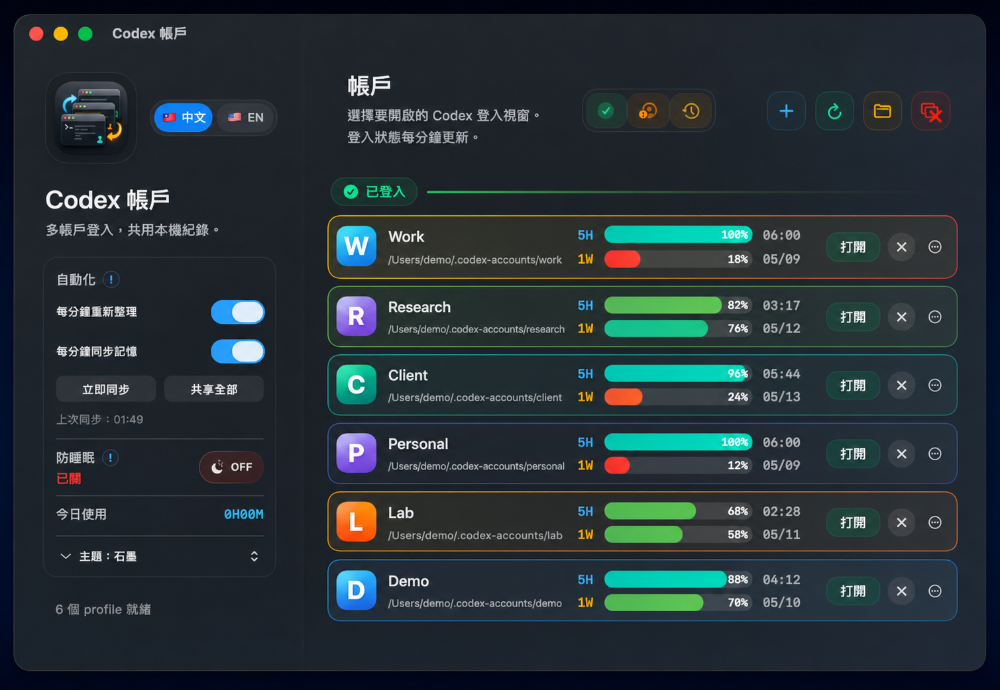
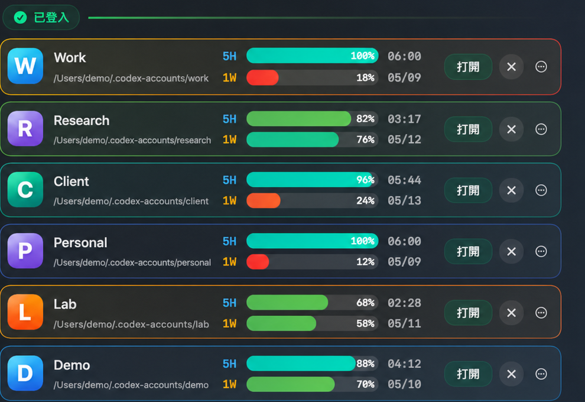
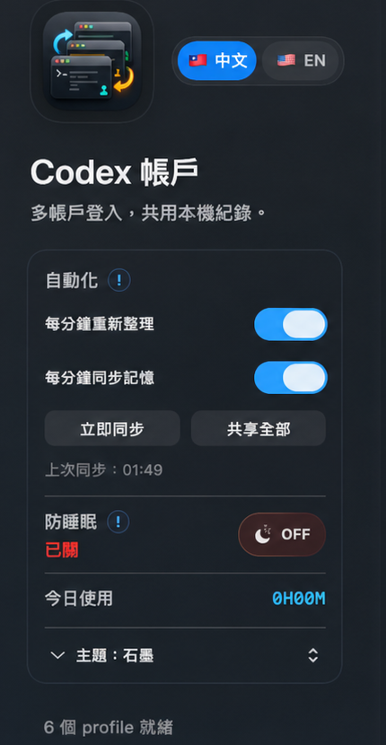
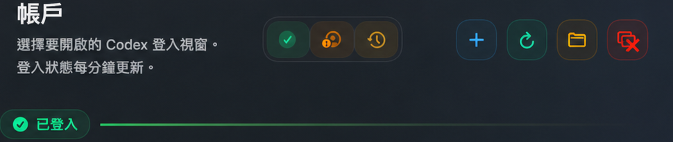
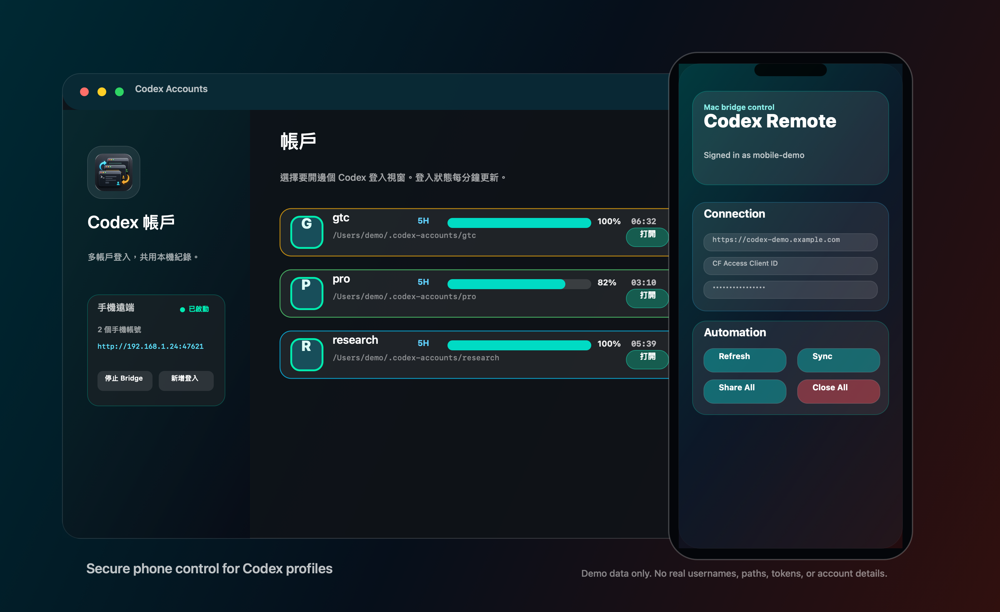

# Codex Accounts

**Languages:** [繁體中文](#繁體中文) | [简体中文](#简体中文) | [English](#english)



> The screenshots use demo profile names and fake local paths. They do not expose real account names or local user paths.

## Screenshots









---

<a id="繁體中文"></a>

## 繁體中文

Codex Accounts 是一個 macOS 小工具，用來管理多個 Codex / OpenAI 帳戶。它會為每個 profile 開一個獨立的 Codex desktop 視窗，並分開 `CODEX_HOME` 和 Electron `user-data-dir`，所以不同 profile 可以保持不同登入狀態，不需要反覆登出登入。

### v2 主要功能

- 多 profile 管理：新增、打開、關閉、改名、顯示資料夾、封存和刪除 profile。
- 每個 profile 獨立登入：不同 OpenAI / GPT 帳戶互不混用 session。
- 打開 profile 前先同步：先同步本機記憶，再共享本機對話紀錄，之後才打開該帳戶視窗。
- 用量顯示：顯示 5H / 1W 額度、百分比和恢復時間，並支援快速 reload 動畫。
- 狀態自動整理：每分鐘刷新登入狀態和 quota，保留最近可用數據，避免畫面突然全變未知。
- 本機對話紀錄共享：可選擇將本機 Codex history 共享到其他 profile。
- 記憶同步：可同步 `AGENTS.md`、`memories/`、`rules/`。
- 防睡眠：用 `caffeinate` 防止 Mac 自動睡眠，按鈕會跟隨實際系統狀態。
- 手機遠端 Bridge：可以喺 Mac app 建立手機登入帳號，Android app 用同一組 username/password 登入後控制 profile、同步、打開/關閉視窗和傳送 prompt。
- 遠端安全選項：Bridge 預設只接受登入 session，支援配合 Tailscale 或 Cloudflare Tunnel + Access service token 使用。
- Liquid Glass 介面：多主題、hover 發光、profile 卡片動效、中文和英文介面。
- 菜單列控制：快速新增、同步、關閉所有 Codex 視窗、切換防睡眠。

### 不會做的事

- 不會複製 OpenAI auth token、cookie 或 account session 到其他 profile。
- 不會同步 OpenAI 雲端對話，也不會同步 ChatGPT server-side memory。
- 不會把帳戶憑證傳到第三方。
- 手機遠端帳號只儲存在本機 `~/Library/Application Support/Codex Accounts/remote-users.json`，密碼用 PBKDF2 hash 儲存。
- 用量查詢只會使用該 profile 的本機 token 請求官方 Codex / ChatGPT 用量接口。
- 這是非官方輔助工具，與 OpenAI 沒有從屬關係。

### 安裝

1. 到 [Releases](https://github.com/siumiu1968/codex-accounts/releases) 下載 `Codex-Accounts-macOS.zip`。
2. 解壓後把 `Codex Accounts.app` 移到 `/Applications`。
3. 從 Finder 開啟 app。

如果 macOS 阻擋第一次開啟，進入 `System Settings` → `Privacy & Security`，找到 `Codex Accounts`，選擇 `Open Anyway`。

### 從源碼構建

```zsh
git clone https://github.com/siumiu1968/codex-accounts.git
cd codex-accounts
scripts/build_codex_accounts_app.zsh
open "/Applications/Codex Accounts.app"
```

建立 release ZIP：

```zsh
scripts/package_release.zsh
```

輸出位置：

```text
dist/Codex-Accounts-macOS.zip
```

建立 Android 遙控 APK：

```zsh
android/build_apk.zsh
```

輸出位置：

```text
android/dist/CodexRemote-debug.apk
```

### 本機資料位置

```text
Account 1: ~/.codex
Account 2: ~/.codex-account2
More profiles: ~/.codex-accounts/<profile-name>
```

Electron app data 會分開放在：

```text
Account 1: ~/Library/Application Support/Codex
Account 2: ~/Library/Application Support/Codex Account 2
More profiles: ~/Library/Application Support/Codex Accounts/<profile-name>
```

刪除 profile 時會先封存到：

```text
~/.codex-accounts-archive
```

---

<a id="简体中文"></a>

## 简体中文

Codex Accounts 是一个 macOS 小工具，用来管理多个 Codex / OpenAI 账号。它会为每个 profile 打开一个独立的 Codex desktop 窗口，并分开 `CODEX_HOME` 和 Electron `user-data-dir`，所以不同 profile 可以保持不同登录状态，不需要反复登出登录。

### v2 主要功能

- 多 profile 管理：新增、打开、关闭、改名、显示资料夹、归档和删除 profile。
- 每个 profile 独立登录：不同 OpenAI / GPT 账号互不混用 session。
- 打开 profile 前先同步：先同步本地记忆，再共享本地对话记录，然后才打开该账号窗口。
- 用量显示：显示 5H / 1W 额度、百分比和恢复时间，并支持快速 reload 动画。
- 状态自动整理：每分钟刷新登录状态和 quota，保留最近可用数据，避免画面突然全变未知。
- 本地对话记录共享：可选择将本地 Codex history 共享到其他 profile。
- 记忆同步：可同步 `AGENTS.md`、`memories/`、`rules/`。
- 防睡眠：用 `caffeinate` 防止 Mac 自动睡眠，按钮会跟随实际系统状态。
- 手机远程 Bridge：可以在 Mac app 创建手机登录账号，Android app 用同一组 username/password 登录后控制 profile、同步、打开/关闭窗口和发送 prompt。
- 远程安全选项：Bridge 默认只接受登录 session，支持配合 Tailscale 或 Cloudflare Tunnel + Access service token 使用。
- Liquid Glass 界面：多主题、hover 发光、profile 卡片动效、中文和英文界面。
- 菜单栏控制：快速新增、同步、关闭所有 Codex 窗口、切换防睡眠。

### 它不会做什么

- 不会复制 OpenAI auth token、cookie 或 account session 到其他 profile。
- 不会同步 OpenAI 云端对话，也不会同步 ChatGPT server-side memory。
- 不会把账号凭证发送到第三方。
- 手机远程账号只保存在本机 `~/Library/Application Support/Codex Accounts/remote-users.json`，密码用 PBKDF2 hash 保存。
- 用量查询只会使用该 profile 的本地 token 请求官方 Codex / ChatGPT 用量接口。
- 这是非官方辅助工具，与 OpenAI 没有关联。

### 安装

1. 到 [Releases](https://github.com/siumiu1968/codex-accounts/releases) 下载 `Codex-Accounts-macOS.zip`。
2. 解压后把 `Codex Accounts.app` 移到 `/Applications`。
3. 从 Finder 打开 app。

如果 macOS 阻挡第一次打开，进入 `System Settings` → `Privacy & Security`，找到 `Codex Accounts`，选择 `Open Anyway`。

### 从源码构建

```zsh
git clone https://github.com/siumiu1968/codex-accounts.git
cd codex-accounts
scripts/build_codex_accounts_app.zsh
open "/Applications/Codex Accounts.app"
```

创建 release ZIP：

```zsh
scripts/package_release.zsh
```

输出位置：

```text
dist/Codex-Accounts-macOS.zip
```

构建 Android 遥控 APK：

```zsh
android/build_apk.zsh
```

输出位置：

```text
android/dist/CodexRemote-debug.apk
```

### 本地数据位置

```text
Account 1: ~/.codex
Account 2: ~/.codex-account2
More profiles: ~/.codex-accounts/<profile-name>
```

Electron app data 会分开保存在：

```text
Account 1: ~/Library/Application Support/Codex
Account 2: ~/Library/Application Support/Codex Account 2
More profiles: ~/Library/Application Support/Codex Accounts/<profile-name>
```

删除 profile 时会先归档到：

```text
~/.codex-accounts-archive
```

---

<a id="english"></a>

## English

Codex Accounts is a macOS helper app for managing multiple Codex / OpenAI accounts. It opens each profile in a separate Codex desktop window with its own `CODEX_HOME` and Electron `user-data-dir`, so different profiles can stay signed in to different accounts without constant logouts.

### v2 Highlights

- Multi-profile management: create, open, close, rename, reveal, archive, and delete profiles.
- Separate sign-in state: every profile keeps its own OpenAI / GPT account session.
- Sync before opening: when opening a profile, the app syncs local memory and shares local chat history first, then opens the account window.
- Usage meters: show 5H / 1W quota, percentage, and reset time with a fast reload animation.
- Stable status refresh: sign-in state and quota refresh every minute, with last-known usage preserved when the endpoint is temporarily unavailable.
- Optional local history sharing across profiles.
- Optional memory sync for `AGENTS.md`, `memories/`, and `rules/`.
- Keep Awake: uses `caffeinate` to stop macOS from sleeping, and the toggle follows the real system process state.
- Mobile Remote Bridge: create a mobile login in the Mac app, then use the Android app with the same username/password to control profiles, sync, open/close windows, and send prompts.
- Remote security options: the bridge requires signed-in bearer sessions and can sit behind Tailscale or Cloudflare Tunnel + Access service tokens.
- Liquid Glass interface: multiple themes, hover glow, profile card animation, Chinese and English UI.
- Menu bar controls: quick create, sync, close all Codex windows, and toggle Keep Awake.

### What It Does Not Do

- It does not copy OpenAI auth tokens, cookies, or account sessions between profiles.
- It does not sync OpenAI cloud chat history or ChatGPT server-side memory.
- It does not send account credentials to third parties.
- Mobile remote users stay local in `~/Library/Application Support/Codex Accounts/remote-users.json`, and passwords are stored as PBKDF2 hashes.
- Usage checks use the profile's local token only against the official Codex / ChatGPT usage endpoint.
- This is an unofficial helper app and is not affiliated with OpenAI.

### Install

1. Download `Codex-Accounts-macOS.zip` from [Releases](https://github.com/siumiu1968/codex-accounts/releases).
2. Unzip it and move `Codex Accounts.app` to `/Applications`.
3. Open the app from Finder.

If macOS blocks the first launch, open `System Settings` → `Privacy & Security`, find `Codex Accounts`, and choose `Open Anyway`.

### Build From Source

```zsh
git clone https://github.com/siumiu1968/codex-accounts.git
cd codex-accounts
scripts/build_codex_accounts_app.zsh
open "/Applications/Codex Accounts.app"
```

Create a release ZIP:

```zsh
scripts/package_release.zsh
```

Output:

```text
dist/Codex-Accounts-macOS.zip
```

Build the Android remote-control APK:

```zsh
android/build_apk.zsh
```

Output:

```text
android/dist/CodexRemote-debug.apk
```

### Local Data

```text
Account 1: ~/.codex
Account 2: ~/.codex-account2
More profiles: ~/.codex-accounts/<profile-name>
```

Separate Electron app data:

```text
Account 1: ~/Library/Application Support/Codex
Account 2: ~/Library/Application Support/Codex Account 2
More profiles: ~/Library/Application Support/Codex Accounts/<profile-name>
```

Deleted profiles are archived here first:

```text
~/.codex-accounts-archive
```

## License

MIT. See [LICENSE](LICENSE).
