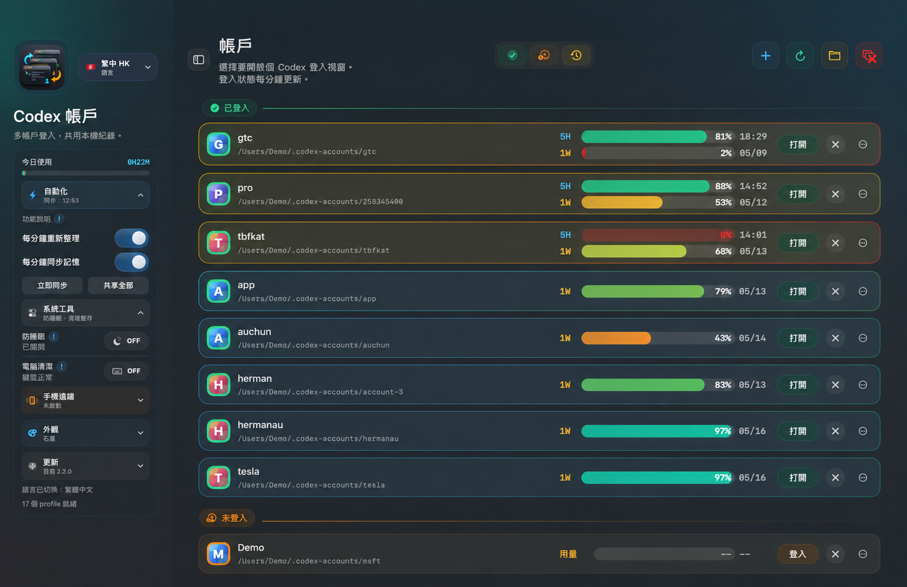
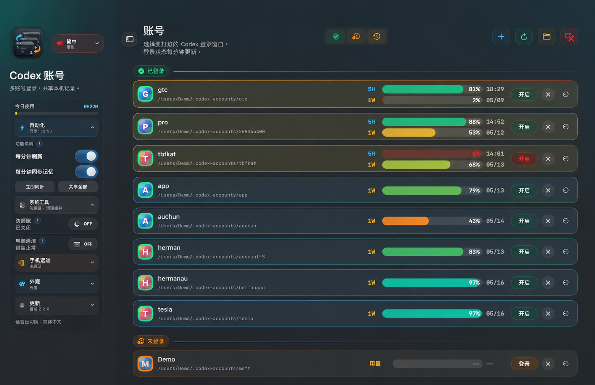
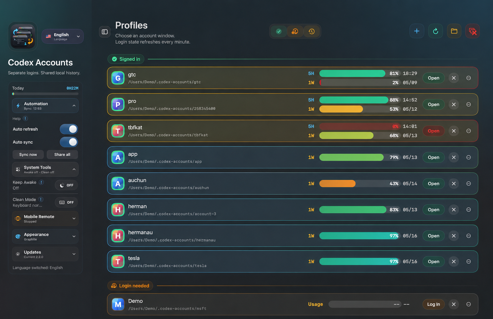

# Codex Accounts

**Languages:** [繁體中文](#繁體中文) | [简体中文](#简体中文) | [English](#english)



> The screenshots use an anonymized local user path. They do not expose the real macOS account name.

## Screenshots






---

<a id="繁體中文"></a>

## 繁體中文

Codex Accounts 是一個 macOS 小工具，用來管理多個 Codex / OpenAI 帳戶。它會為每個 profile 開一個獨立的 Codex desktop 視窗，並分開 `CODEX_HOME` 和 Electron `user-data-dir`，所以不同 profile 可以保持不同登入狀態，不需要反覆登出登入。

### V2.3.6 更新介紹

V2.3.6 修復自動刷新唔會準確更新 quota 嘅問題。自動刷新而家會定時做低負荷 live quota refresh，效果等同背景撳 Reload，但唔會播 loading pill 或 quota 數字倒數動畫；背景查詢改用單一並行度串行跑，避免短時間開太多 Codex app-server 或令 Mac 負荷升高。

### V2.3.5 更新介紹

V2.3.5 令右上角「關閉全部 Codex 視窗」反應快好多。底層 script 由逐個 profile 重複掃 `ps/pgrep`，改成一次 process snapshot 就計晒所有要關同要保留嘅 Codex 視窗；仍然會跳過 primary/default Codex，同埋保留有 active agent/app-server 工作嘅視窗，避免關到正在工作的對話。

### V2.3.4 更新介紹

V2.3.4 修復多 profile 用耐之後出現紅色 timeout、模型設定更新失敗、記憶同步似乎消失嘅問題。打開 profile 前仍然會同步記憶，但同步策略改為「全部 profile 記憶 + 目標 profile payload」：`AGENTS.md`、`memories/`、`rules/` 和外掛啟用設定會掃晒全部 profile，`plugins/`、`skills/`、`vendor_imports/` 只補 primary 同即將打開嘅 profile，並跳過 `plugin-backup-*` / `plugin-install-*` 垃圾目錄。自動刷新亦改為快取優先，手動 reload 先查 live quota，避免背景開大量 app-server。

### V2.3.3 更新介紹

V2.3.3 修復兩個阻塞問題：更新通道依家會寫入安裝 log、先備份舊 app 再替換，失敗會自動還原，亦會更新目前實際執行緊嘅 `Codex Accounts.app`。右上角「關閉全部 Codex 視窗」會跳過 primary/default Codex，只關 Codex Accounts 管理嘅 profile，同時避開 `--listen stdio://` / proxy 呢類背景 agent server，減少誤關工作中對話。

### V2.3.2 更新介紹

V2.3.2 修復更新後偶發「打開帳戶」冇反應嘅問題。原因係同步流程開始搬大量 `plugins/`、`skills/`、`vendor_imports/` payload，每個 profile 可能有幾百 MB，令開帳戶前嘅同步被 `rsync` 卡住。依家 `sync-once` 預設只同步記憶、rules、AGENTS 同外掛啟用設定；重型外掛 payload 要手動用 `CODEX_SYNC_PLUGIN_PAYLOADS=1` 才會同步。打開 profile 時亦唔再被同步/共享紀錄失敗阻塞，會盡快繼續開啟目標帳戶。App 重新開啟或 Dock 點擊時亦會重新顯示主視窗。

### V2.3.1 更新介紹

V2.3.1 修復三個即時使用問題：當 direct ChatGPT 用量接口暫時被 401/403 或 Cloudflare 擋住時，app 會改用 Codex 官方 app-server rate-limit API 讀取真實 quota；如果仍然攞唔到官方數據，就停止用過期 cache 扮最新數。最細視窗寬度下，頂部跳轉掣同右上角 `+ / reload / folder / close all` 工具列亦收窄排版，避免 `+` 掣同其他掣重疊。多帳戶同步現在亦會同步 `plugins/`、`skills/`、`vendor_imports/`，並合併各帳戶 `config.toml` 入面啟用咗嘅外掛。

### V2.3.0 更新介紹

V2.3.0 重點修復長時間使用後偶發卡死嘅問題。外部 Codex script / 系統 helper 依家唔再用會累積卡住線程嘅等待方式，所有背景 Codex 工作會串行處理；自動刷新同自動同步亦會輪流執行，避免同一時間爭用 profile 檔案。防睡眠同手機 Bridge 狀態檢查加咗 in-flight guard 同節流，減少用耐之後背景 process 疊住跑。

### v2 主要功能

- 多 profile 管理：新增、打開、關閉、改名、顯示資料夾、封存和刪除 profile。
- 每個 profile 獨立登入：不同 OpenAI / GPT 帳戶互不混用 session。
- 打開 profile 前先同步：先同步本機記憶、rules、AGENTS 同外掛設定，之後才打開該帳戶視窗。
- 用量顯示：顯示 5H / 1W 額度、百分比和恢復時間，並支援快速 reload 動畫。
- 狀態自動整理：每分鐘刷新登入狀態和 quota，保留最近可用數據，避免畫面突然全變未知。
- 本機對話紀錄共享：可選擇將本機 Codex history 共享到其他 profile。
- 記憶與外掛同步：可同步 `AGENTS.md`、`memories/`、`rules/`、`plugins/`、`skills/`、`vendor_imports/`，外掛啟用狀態會喺不同帳號之間合併。
- 防睡眠：用 `caffeinate` 防止 Mac 自動睡眠，按鈕會跟隨實際系統狀態；開啟時會監察合蓋狀態，合蓋降內置屏幕亮度，開蓋或關閉功能時恢復亮度。
- 電腦清潔模式：暫停大部分鍵盤輸入，方便清潔鍵盤，保留滑鼠/觸控板操作去關閉模式。
- 手機遠端 Bridge：可以喺 Mac app 建立手機登入帳號，Android app 用同一組 username/password 登入後控制 profile、同步、打開/關閉視窗和傳送 prompt。
- 遠端安全選項：Bridge 預設只接受登入 session，支援配合 Tailscale 或 Cloudflare Tunnel + Access service token 使用。
- 更新通道：檢查 GitHub release，驗證下載檔版本同 bundle id，然後自動替換 `/Applications/Codex Accounts.app`。
- Liquid Glass 介面：多主題、hover 發光、profile 卡片動效、繁中香港 / 繁中台灣 / 簡中 / 英文介面。
- 菜單列控制：快速新增、同步、關閉所有 Codex 視窗、切換防睡眠。

### 不會做的事

- 不會複製 OpenAI auth token、cookie 或 account session 到其他 profile。
- 不會同步 OpenAI 雲端對話，也不會同步 ChatGPT server-side memory。
- 不會把帳戶憑證傳到第三方。
- 手機遠端帳號只儲存在本機 `~/Library/Application Support/Codex Accounts/remote-users.json`，密碼用 PBKDF2 hash 儲存。
- 用量查詢只會使用該 profile 的本機 token 請求官方 Codex / ChatGPT 用量接口。
- 這是非官方輔助工具，與 OpenAI 沒有從屬關係。

### 安裝

1. 到 [Releases](https://github.com/siumiu1968/codex-accounts/releases) 下載 `Codex-Accounts-macOS.zip`。
2. 解壓後把 `Codex Accounts.app` 移到 `/Applications`。
3. 從 Finder 開啟 app。

如果 macOS 阻擋第一次開啟，進入 `System Settings` → `Privacy & Security`，找到 `Codex Accounts`，選擇 `Open Anyway`。

安裝 V2.3.6 之後，可以直接喺 app 入面檢查同安裝下一個 GitHub release。

### 從源碼構建

```zsh
git clone https://github.com/siumiu1968/codex-accounts.git
cd codex-accounts
scripts/build_codex_accounts_app.zsh
open "/Applications/Codex Accounts.app"
```

建立 release ZIP：

```zsh
scripts/package_release.zsh
```

輸出位置：

```text
dist/Codex-Accounts-macOS.zip
```

建立 Android 遙控 APK：

```zsh
android/build_apk.zsh
```

輸出位置：

```text
android/dist/CodexRemote-debug.apk
```

### 本機資料位置

```text
Account 1: ~/.codex
Account 2: ~/.codex-account2
More profiles: ~/.codex-accounts/<profile-name>
```

Electron app data 會分開放在：

```text
Account 1: ~/Library/Application Support/Codex
Account 2: ~/Library/Application Support/Codex Account 2
More profiles: ~/Library/Application Support/Codex Accounts/<profile-name>
```

刪除 profile 時會先封存到：

```text
~/.codex-accounts-archive
```

---

<a id="简体中文"></a>

## 简体中文

Codex Accounts 是一个 macOS 小工具，用来管理多个 Codex / OpenAI 账号。它会为每个 profile 打开一个独立的 Codex desktop 窗口，并分开 `CODEX_HOME` 和 Electron `user-data-dir`，所以不同 profile 可以保持不同登录状态，不需要反复登出登录。

### V2.3.6 更新介绍

V2.3.6 修复自动刷新不会准确更新 quota 的问题。自动刷新现在会定时做低负荷 live quota refresh，效果等同后台点击 Reload，但不会播放 loading pill 或 quota 数字倒数动画；后台查询改用单一并行度串行运行，避免短时间打开太多 Codex app-server 或让 Mac 负荷升高。

### V2.3.5 更新介绍

V2.3.5 让右上角“关闭全部 Codex 窗口”反应快很多。底层 script 从逐个 profile 重复扫描 `ps/pgrep`，改成一次 process snapshot 就算出所有要关闭和要保留的 Codex 窗口；仍然会跳过 primary/default Codex，并保留有 active agent/app-server 工作的窗口，避免关掉正在工作的对话。

### V2.3.4 更新介绍

V2.3.4 修复多 profile 用久之后出现红色 timeout、模型设置更新失败、记忆同步看似消失的问题。打开 profile 前仍然会同步记忆，但同步策略改为“全部 profile 记忆 + 目标 profile payload”：`AGENTS.md`、`memories/`、`rules/` 和插件启用设置会扫描所有 profile，`plugins/`、`skills/`、`vendor_imports/` 只补 primary 和即将打开的 profile，并跳过 `plugin-backup-*` / `plugin-install-*` 垃圾目录。自动刷新也改为快取优先，手动 reload 才查 live quota，避免后台打开大量 app-server。

### V2.3.3 更新介绍

V2.3.3 修复两个阻塞问题：更新通道现在会写入安装 log、先备份旧 app 再替换，失败会自动还原，也会更新当前实际运行的 `Codex Accounts.app`。右上角“关闭全部 Codex 窗口”会跳过 primary/default Codex，只关闭 Codex Accounts 管理的 profile，同时避开 `--listen stdio://` / proxy 这类后台 agent server，减少误关工作中的对话。

### V2.3.2 更新介绍

V2.3.2 修复更新后偶发“打开账号”没有反应的问题。原因是同步流程开始搬运大量 `plugins/`、`skills/`、`vendor_imports/` payload，每个 profile 可能有几百 MB，导致打开账号前的同步被 `rsync` 卡住。现在 `sync-once` 默认只同步记忆、rules、AGENTS 和插件启用设置；重型插件 payload 需要手动用 `CODEX_SYNC_PLUGIN_PAYLOADS=1` 才会同步。打开 profile 时也不再被同步/共享记录失败阻塞，会尽快继续打开目标账号。App 重新打开或点击 Dock 时也会重新显示主窗口。

### V2.3.1 更新介绍

V2.3.1 修复三个即时使用问题：当 direct ChatGPT 用量接口临时被 401/403 或 Cloudflare 拦截时，app 会改用 Codex 官方 app-server rate-limit API 读取真实 quota；如果仍然拿不到官方数据，就停止用过期 cache 冒充最新数值。最小窗口宽度下，顶部跳转按钮和右上角 `+ / reload / folder / close all` 工具列也收窄排版，避免 `+` 按钮和其他按钮重叠。多账号同步现在也会同步 `plugins/`、`skills/`、`vendor_imports/`，并合并各账号 `config.toml` 里已启用的插件。

### V2.3.0 更新介绍

V2.3.0 重点修复长时间使用后偶发卡死的问题。外部 Codex script / 系统 helper 现在不再使用会累积卡住线程的等待方式，所有后台 Codex 工作会串行处理；自动刷新和自动同步也会轮流执行，避免同一时间争用 profile 文件。防睡眠和手机 Bridge 状态检查加入 in-flight guard 和节流，减少用久之后后台 process 叠加运行。

### v2 主要功能

- 多 profile 管理：新增、打开、关闭、改名、显示资料夹、归档和删除 profile。
- 每个 profile 独立登录：不同 OpenAI / GPT 账号互不混用 session。
- 打开 profile 前先同步：先同步本地记忆、rules、AGENTS 和插件设置，然后才打开该账号窗口。
- 用量显示：显示 5H / 1W 额度、百分比和恢复时间，并支持快速 reload 动画。
- 状态自动整理：每分钟刷新登录状态和 quota，保留最近可用数据，避免画面突然全变未知。
- 本地对话记录共享：可选择将本地 Codex history 共享到其他 profile。
- 记忆与插件同步：可同步 `AGENTS.md`、`memories/`、`rules/`、`plugins/`、`skills/`、`vendor_imports/`，插件启用状态会在不同账号之间合并。
- 防睡眠：用 `caffeinate` 防止 Mac 自动睡眠，按钮会跟随实际系统状态；开启时会监测合盖状态，合盖降低内置屏幕亮度，开盖或关闭功能时恢复亮度。
- 电脑清洁模式：暂停大部分键盘输入，方便清洁键盘，保留鼠标/触控板操作去关闭模式。
- 手机远程 Bridge：可以在 Mac app 创建手机登录账号，Android app 用同一组 username/password 登录后控制 profile、同步、打开/关闭窗口和发送 prompt。
- 远程安全选项：Bridge 默认只接受登录 session，支持配合 Tailscale 或 Cloudflare Tunnel + Access service token 使用。
- 更新通道：检查 GitHub release，验证下载文件版本和 bundle id，然后自动替换 `/Applications/Codex Accounts.app`。
- Liquid Glass 界面：多主题、hover 发光、profile 卡片动效、繁中香港 / 繁中台湾 / 简中 / 英文界面。
- 菜单栏控制：快速新增、同步、关闭所有 Codex 窗口、切换防睡眠。

### 它不会做什么

- 不会复制 OpenAI auth token、cookie 或 account session 到其他 profile。
- 不会同步 OpenAI 云端对话，也不会同步 ChatGPT server-side memory。
- 不会把账号凭证发送到第三方。
- 手机远程账号只保存在本机 `~/Library/Application Support/Codex Accounts/remote-users.json`，密码用 PBKDF2 hash 保存。
- 用量查询只会使用该 profile 的本地 token 请求官方 Codex / ChatGPT 用量接口。
- 这是非官方辅助工具，与 OpenAI 没有关联。

### 安装

1. 到 [Releases](https://github.com/siumiu1968/codex-accounts/releases) 下载 `Codex-Accounts-macOS.zip`。
2. 解压后把 `Codex Accounts.app` 移到 `/Applications`。
3. 从 Finder 打开 app。

如果 macOS 阻挡第一次打开，进入 `System Settings` → `Privacy & Security`，找到 `Codex Accounts`，选择 `Open Anyway`。

安装 V2.3.6 之后，可以直接在 app 里检查并安装下一个 GitHub release。

### 从源码构建

```zsh
git clone https://github.com/siumiu1968/codex-accounts.git
cd codex-accounts
scripts/build_codex_accounts_app.zsh
open "/Applications/Codex Accounts.app"
```

创建 release ZIP：

```zsh
scripts/package_release.zsh
```

输出位置：

```text
dist/Codex-Accounts-macOS.zip
```

构建 Android 遥控 APK：

```zsh
android/build_apk.zsh
```

输出位置：

```text
android/dist/CodexRemote-debug.apk
```

### 本地数据位置

```text
Account 1: ~/.codex
Account 2: ~/.codex-account2
More profiles: ~/.codex-accounts/<profile-name>
```

Electron app data 会分开保存在：

```text
Account 1: ~/Library/Application Support/Codex
Account 2: ~/Library/Application Support/Codex Account 2
More profiles: ~/Library/Application Support/Codex Accounts/<profile-name>
```

删除 profile 时会先归档到：

```text
~/.codex-accounts-archive
```

---

<a id="english"></a>

## English

Codex Accounts is a macOS helper app for managing multiple Codex / OpenAI accounts. It opens each profile in a separate Codex desktop window with its own `CODEX_HOME` and Electron `user-data-dir`, so different profiles can stay signed in to different accounts without constant logouts.

### V2.3.6 Update

V2.3.6 fixes automatic refresh not reliably updating quota. Auto refresh now performs a low-load live quota refresh on a schedule, equivalent to pressing Reload in the background, but without the loading pill or quota countdown animation. The background quota query runs with single-profile parallelism to avoid spawning too many Codex app-server processes or raising Mac load.

### V2.3.5 Update

V2.3.5 makes the top-right Close All Codex Windows action much more responsive. The script now takes one process snapshot and computes all closable/kept Codex windows in one pass instead of repeatedly scanning `ps/pgrep` for every profile. It still skips primary/default Codex and keeps windows with active agent/app-server work so running conversations are not interrupted.

### V2.3.4 Update

V2.3.4 fixes red timeout toasts, model-setting update failures, and memory sync that could appear to disappear after long multi-profile use. Opening a profile still syncs memory first, but the sync now uses "all-profile memory + target-profile payloads": `AGENTS.md`, `memories/`, `rules/`, and enabled plugin settings are scanned across every profile, while `plugins/`, `skills/`, and `vendor_imports/` are refreshed only for the primary profile and the profile being opened. `plugin-backup-*` and `plugin-install-*` folders are skipped. Automatic refresh is cache-first; live quota checks only run on manual reload, preventing background app-server pileups.

### V2.3.3 Update

V2.3.3 fixes two blocking issues. The update channel now writes an install log, backs up the old app before replacement, restores it on failure, and updates the exact `Codex Accounts.app` bundle that is currently running. The top-right Close All Codex Windows action skips primary/default Codex and only closes profiles managed by Codex Accounts, while avoiding `--listen stdio://` and proxy agent servers so active agent conversations are less likely to be interrupted.

### V2.3.2 Update

V2.3.2 fixes an issue where opening an account could appear to do nothing after the latest sync changes. The cause was heavy `plugins/`, `skills/`, and `vendor_imports/` payload syncing before launch; each profile can contain hundreds of MB, so `rsync` could block the open flow. `sync-once` now defaults to lightweight memory, rules, AGENTS, and enabled-plugin config sync. Heavy plugin payload copying is opt-in with `CODEX_SYNC_PLUGIN_PAYLOADS=1`. Opening a profile also continues even if pre-open sync or history sharing times out, and reopening the app or clicking the Dock icon reliably brings the main window back.

### V2.3.1 Update

V2.3.1 fixes three live-use issues. When the direct ChatGPT usage endpoint is temporarily blocked by 401/403 or Cloudflare, the app now falls back to Codex's official app-server rate-limit API for real quota data; if official data still cannot be fetched, it stops treating expired cache as current. The compact header layout also narrows the section-jump control and the `+ / reload / folder / close all` toolbar at the minimum window width, preventing the `+` button from overlapping another control. Multi-account sync now also shares `plugins/`, `skills/`, and `vendor_imports/`, while merging enabled plugin entries from each account's `config.toml`.

### V2.3.0 Update

V2.3.0 fixes an intermittent freeze that could appear after the app had been running for a while. External Codex scripts and system helpers no longer use a waiting path that can leak stuck worker threads, and Codex background work is now serialized. Auto refresh and auto sync alternate instead of competing for profile files at the same time. Keep Awake and Mobile Bridge status checks also use in-flight guards and throttling so background processes cannot pile up over time.

### v2 Highlights

- Multi-profile management: create, open, close, rename, reveal, archive, and delete profiles.
- Separate sign-in state: every profile keeps its own OpenAI / GPT account session.
- Sync before opening: when opening a profile, the app syncs local memory, rules, AGENTS, and plugin settings first, then opens the account window.
- Usage meters: show 5H / 1W quota, percentage, and reset time with a fast reload animation.
- Stable status refresh: sign-in state and quota refresh every minute, with last-known usage preserved when the endpoint is temporarily unavailable.
- Optional local history sharing across profiles.
- Optional memory and plugin sync for `AGENTS.md`, `memories/`, `rules/`, `plugins/`, `skills/`, and `vendor_imports/`, including enabled plugin entries across accounts.
- Keep Awake: uses `caffeinate` to stop macOS from sleeping, follows the real system process state, monitors lid state, dims the built-in display when the lid closes, and restores brightness when opened or turned off.
- Keyboard Clean Mode: blocks most keyboard input while keeping mouse/trackpad control available so the mode can be turned off safely.
- Mobile Remote Bridge: create a mobile login in the Mac app, then use the Android app with the same username/password to control profiles, sync, open/close windows, and send prompts.
- Remote security options: the bridge requires signed-in bearer sessions and can sit behind Tailscale or Cloudflare Tunnel + Access service tokens.
- Update channel: checks GitHub releases, validates the downloaded app version and bundle id, then replaces `/Applications/Codex Accounts.app`.
- Liquid Glass interface: multiple themes, hover glow, profile card animation, Traditional Chinese HK/TW, Simplified Chinese, and English UI.
- Menu bar controls: quick create, sync, close all Codex windows, and toggle Keep Awake.

### What It Does Not Do

- It does not copy OpenAI auth tokens, cookies, or account sessions between profiles.
- It does not sync OpenAI cloud chat history or ChatGPT server-side memory.
- It does not send account credentials to third parties.
- Mobile remote users stay local in `~/Library/Application Support/Codex Accounts/remote-users.json`, and passwords are stored as PBKDF2 hashes.
- Usage checks use the profile's local token only against the official Codex / ChatGPT usage endpoint.
- This is an unofficial helper app and is not affiliated with OpenAI.

### Install

1. Download `Codex-Accounts-macOS.zip` from [Releases](https://github.com/siumiu1968/codex-accounts/releases).
2. Unzip it and move `Codex Accounts.app` to `/Applications`.
3. Open the app from Finder.

If macOS blocks the first launch, open `System Settings` → `Privacy & Security`, find `Codex Accounts`, and choose `Open Anyway`.

After installing V2.3.6, future GitHub releases can be checked and installed directly inside the app.

### Build From Source

```zsh
git clone https://github.com/siumiu1968/codex-accounts.git
cd codex-accounts
scripts/build_codex_accounts_app.zsh
open "/Applications/Codex Accounts.app"
```

Create a release ZIP:

```zsh
scripts/package_release.zsh
```

Output:

```text
dist/Codex-Accounts-macOS.zip
```

Build the Android remote-control APK:

```zsh
android/build_apk.zsh
```

Output:

```text
android/dist/CodexRemote-debug.apk
```

### Local Data

```text
Account 1: ~/.codex
Account 2: ~/.codex-account2
More profiles: ~/.codex-accounts/<profile-name>
```

Separate Electron app data:

```text
Account 1: ~/Library/Application Support/Codex
Account 2: ~/Library/Application Support/Codex Account 2
More profiles: ~/Library/Application Support/Codex Accounts/<profile-name>
```

Deleted profiles are archived here first:

```text
~/.codex-accounts-archive
```

## License

MIT. See [LICENSE](LICENSE).
