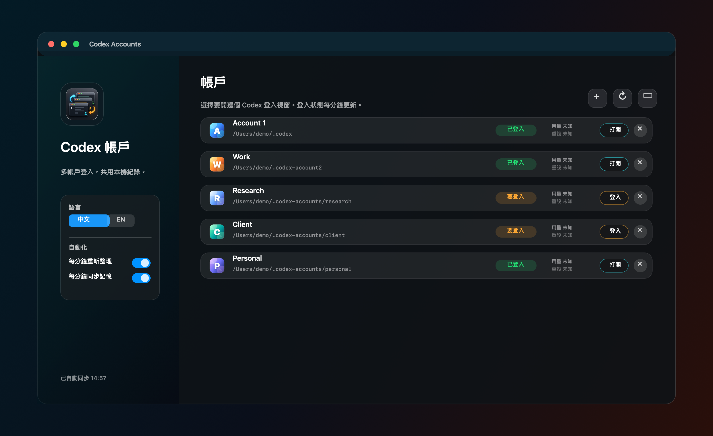

# Codex Accounts

**语言：** [English](README.md) | 简体中文



Codex Accounts 是一个 macOS 小工具，用来为不同 OpenAI / GPT 账号打开独立的 Codex 桌面登录窗口，同时把本地 Codex profile 管理集中到一个界面里。

如果你经常在多个账号之间切换，不想反复登出、登录、打断当前工作流，这个工具会比较有用。

## 功能

- 创建任意数量的本地 Codex profile。
- 每个 profile 用独立的 Codex 桌面窗口打开。
- 每个 profile 使用独立的 `CODEX_HOME` 和 Electron `--user-data-dir`，登录状态互不混用。
- 每分钟自动刷新本地登录状态。
- 在一个窗口里改名、关闭、显示资料夹、归档、删除 profile。
- 可选：在多个 profile 之间共享本地 Codex 对话记录。
- 可选：同步本地记忆文件，包括 `AGENTS.md`、`memories/`、`rules/`。
- 菜单栏快速打开不同账号窗口。
- 防睡眠开关，适合长时间运行 Codex 任务。
- 支持中文和英文界面。

## 它不会做什么

- 不会复制 OpenAI auth token、cookie 或账号 session。
- 不会同步 OpenAI 云端对话记录，也不会同步 ChatGPT 服务端 memory。
- 如果 Codex 本身没有提供可靠的本地数据，用量和重置时间可能会显示为未知。
- 这是非官方辅助工具，与 OpenAI 没有关联。

## 系统要求

- macOS 13 或更新版本。
- 官方 Codex 桌面应用已安装在 `/Applications/Codex.app`。
- 只有从源码构建时才需要 Xcode Command Line Tools。

## 安装

### 下载 Release

1. 打开 GitHub Releases 页面。
2. 下载 `Codex-Accounts-macOS.zip`。
3. 解压后把 `Codex Accounts.app` 移到 `/Applications`。
4. 从 Finder 打开。

如果 macOS 显示 `Apple 无法验证 “Codex Accounts” 有没有包含可能危害你的 Mac 或泄漏隐私的恶意软件`：

1. 打开 `System Settings`。
2. 进入 `Privacy & Security`。
3. 找到 `Codex Accounts` 被拦截的提示。
4. 点击 `Open Anyway`。
5. 再次打开 app。

### 从源码构建

克隆这个仓库，然后运行：

```zsh
git clone https://github.com/siumiu1968/codex-accounts.git
cd codex-accounts
scripts/build_codex_accounts_app.zsh
open "/Applications/Codex Accounts.app"
```

创建发布 ZIP：

```zsh
scripts/package_release.zsh
```

ZIP 会生成在：

```text
dist/Codex-Accounts-macOS.zip
```

把这个 ZIP 上传到 GitHub Releases，其他人就可以直接下载使用。

## 使用方法

1. 启动 `Codex Accounts`。
2. 点击 `+` 创建新 profile。
3. 点击该 profile 的 `登录` / `Log In`。
4. 在打开的 Codex 窗口里登录你想使用的 OpenAI / GPT 账号。
5. 之后点击 `打开` / `Open` 重新打开该 profile。
6. 点击某一行的 `x`，只关闭该 profile 对应的 Codex 窗口。
7. 使用 `...` 菜单改名、显示资料夹、共享本地历史或归档 profile。

## 本地文件位置

默认 profile 位置：

```text
Account 1: ~/.codex
Account 2: ~/.codex-account2
更多账号: ~/.codex-accounts/<profile-name>
```

独立 Electron app data：

```text
Account 1: ~/Library/Application Support/Codex
Account 2: ~/Library/Application Support/Codex Account 2
更多账号: ~/Library/Application Support/Codex Accounts/<profile-name>
```

删除 profile 时会先归档，不会立刻永久删除：

```text
~/.codex-accounts-archive
```

## 共享本地对话记录

`Share History` 会把 Account 1 的本地 Codex 历史文件链接到另一个 profile。登录文件仍然保持分离。

请先理解这个取舍再使用：它可以让多个 profile 看到同一份本地历史，但这些 profile 会共享同一组本地历史文件。

## 记忆同步

记忆同步会复制这些本地项目：

```text
AGENTS.md
memories/
rules/
```

它会刻意跳过登录文件、cookie、SQLite 日志、sessions、cache 和临时文件。

## 常见问题

如果打开了错误账号，请先在 Codex Accounts 里点击该 profile 的 `x` 关闭窗口，再从正确的 profile 行重新打开。尽量不要直接从普通 Codex app 图标打开 profile 窗口，因为普通 Codex app 会使用默认 profile。

如果 profile 显示 `要登录` / `Login needed`，打开它并重新登录。改密码或本地 auth 过期后可能会出现这种情况。

如果用量一直显示未知，这是目前预期行为。这个 app 只显示可靠的本地状态。

## 隐私

所有 profile 都是你 Mac 上的本地文件夹。这个 app 不会上传你的文件，也不会把账号凭证发送到其他地方。它只是用不同的本地 profile 目录启动官方 Codex app。

## License

MIT. See [LICENSE](LICENSE).
